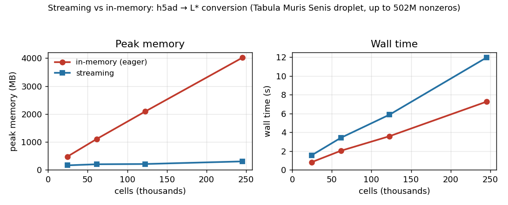

# L★

**A general model for single-cell omics data — built from *axes* and *fields* — and the
lightweight glue that moves data losslessly between AnnData, Seurat, SingleCellExperiment, and
pagoda/conos, including their disk-backed forms (backed AnnData, Seurat v5/BPCells, SCE/HDF5Array) — so
even datasets too large for memory convert in bounded memory.**

L★ represents a dataset as **axes** (the entities you index by — cells, genes, samples, clusters) and
**fields** (typed data over them — counts, embeddings, graphs, labels, designs). Because everything is
just axes and fields, one small model spans the diversity of real single-cell work that a fixed
`cells × genes` container strains on — for example a multi-sample (even cross-species) integration kept
as a *collection* of heterogeneous samples rather than one concatenated matrix; a CITE-seq object with
a second, protein feature axis; or a case-control cohort carrying a statistical *design* over its
samples. The routine count-matrix-plus-a-clustering case stays just as simple, while the harder cases
use the same vocabulary instead of an opaque `uns`/`misc` blob (see [Why lstar?](#why-lstar)).

In the short term, the most immediately useful thing this buys you is **[moving data between the formats
people already use](SUPPORT.md)**. Each existing container — [AnnData](docs/formats/anndata.md) (Python),
[Seurat](docs/formats/seurat.md) and [SingleCellExperiment](docs/formats/singlecellexperiment.md) (R),
pagoda/conos — fixes a few named slots; routing a dataset through L★ converts one to another while
preserving the *meaning* of each piece and **reporting** anything a target can't hold instead of
dropping it silently.

lstar is available in **Python, R, and C++** (sharing one fast C++ core), reads and writes a portable
[Zarr](https://zarr.dev)-based format, and is built to scale. Everything heavy can be **streamed in
bounded memory** — convert a multi-gigabyte dataset, write a store, or compute per-gene statistics
without ever loading the whole matrix, so work that needs a big machine today runs on a laptop (see
[Large data: lazy reads and streaming](#large-data-lazy-reads-and-streaming)). You can also open a
million-cell dataset over the network and read just the parts you need.

> **Status:** early-development alpha; the Python package ships on PyPI as `lstar-sc`. Working today: read/write the same store from
> Python, C++, and R; profiles for AnnData, Seurat (legacy v2 → v5), SingleCellExperiment, and Conos; the
> collection model; lazy/streaming reads; a browser/WebAssembly data layer.

---

## Why lstar?

Three things are hard with today's fixed-schema containers, and L★ is designed around them:

1. **Conversion is lossy and pairwise.** Every container hard-codes a few named slots; what fits the
   slots converts, and the rest is lost. Routing every format through *one shared model with a shared
   vocabulary* makes conversion lossless on the common core and **explicit** about the remainder.
2. **The interesting results have no home.** A gene-regulatory network, a cell–cell communication
   tensor, RNA-velocity graphs, a fitted model — none of these fit a `cells × genes` slot, so they end
   up as opaque blobs in `uns`/`misc`. In L★ they are ordinary, typed, queryable *fields*.
3. **A study is many samples, not one matrix.** Different donors, conditions, even species and gene
   sets cannot be honestly concatenated into a single matrix. L★ keeps a multi-sample study as a
   *collection* of heterogeneous parts joined by a graph.

If you only ever need to move data between AnnData, Seurat, and SCE, point 1 is reason enough to use
lstar. Points 2 and 3 are why the model is shaped the way it is.

## Converting between formats (the common case)

One command — `lstar convert` detects each format from its path, routes through the L★ store (in-process
for Python formats, an `Rscript` bridge for Seurat/SCE), and reports what crossed:

```bash
lstar convert pbmc.h5ad pbmc.rds              # AnnData (Python) -> Seurat (R), bridged automatically
lstar convert atlas.h5ad atlas.lstar.zarr     # -> a portable L* store  (--to sce for SingleCellExperiment)
lstar convert pbmc.rds  pbmc.h5ad --report    # + a fidelity report (every field, and what was `dropped`)
```

Two things make it more than a one-liner:

- a **fidelity report** (`--report` / `--report-json`) lists every axis and field with its role, state,
  and `provenance`, and — crucially — **`dropped`**: what the target couldn't represent, made visible
  rather than silently lost.
- a **native-acceptance check** (`--check`, on by default; `--strict` to gate the exit code) opens the
  result in its *own* library and runs a canonical-ops smoke (scanpy / Seurat / scran), so you know the
  native analysis tools will accept it — not just that the bytes round-tripped.
- a **package-free fallback** (`--backend auto|native|direct`): each conversion uses the format's native
  package when it's installed, else lstar's own codec — so you don't *need* the domain packages for the
  common cases. What works **without** the native packages:

  | convert (no native package) | needs only |
  |---|---|
  | `.h5ad` ↔ store — read **and** write | `lstar` + `h5py` |
  | Seurat `.rds` ↔ store — read **and** write | `lstar` + base R (no SeuratObject) |
  | SCE `.rds` → store — **read** | `lstar` + base R (no SingleCellExperiment) |
  | store → SCE `.rds` (write) · `.h5mu` ↔ store | **native-only** — needs `SingleCellExperiment` / `mudata` |

  At a wall (an unknown on-disk version, a `BPCells`-backed matrix) it stops and names exactly what to
  install. The heavy *analysis* packages (scanpy / full Seurat / scran) are **never** needed to convert —
  only for the optional `--check`. Details: [docs/conversions.md](docs/conversions.md).

Under the hood it is just `write_Y(read_X(...))` with the on-disk L★ store as the bridge between the two
languages, which you can also drive directly:

```bash
python3 -c 'import anndata as ad, lstar; from lstar.profiles.anndata import read_anndata
lstar.write(read_anndata(ad.read_h5ad("pbmc.h5ad")), "pbmc.lstar.zarr")'      # AnnData -> L* store
Rscript -e 'library(lstar); saveRDS(write_seurat(lstar_read("pbmc.lstar.zarr")), "pbmc.rds")'  # -> Seurat
```

The shared-vocabulary core — raw counts, normalized/scaled expression, PCA (scores **and** gene
loadings), UMAP/t-SNE, clusterings, cell/gene metadata — survives. Whatever the target can't hold (e.g.
neighbor graphs through Seurat) is listed in the dataset's `dropped` manifest, so nothing vanishes
unannounced. A runnable, commented version is
[`examples/convert_h5ad_to_seurat.sh`](examples/convert_h5ad_to_seurat.sh).

See **[docs/conversions.md](docs/conversions.md)** for the full glue guide (every reader/writer, the
conversion matrix, what is preserved vs. recorded as dropped, version detection) and
**[docs/mapping.md](docs/mapping.md)** for the deterministic role→slot contract — what lands where in
each target, and the native-acceptance check that verifies the native tools won't choke.

## Building a dataset directly

If you want to author or inspect L★ data, the model is just *axes* (the things you index by) and
*fields* (typed data over them):

```python
import scipy.sparse as sp, lstar

ds = lstar.Dataset(kind="sample")
ds.add_axis("cells", [f"cell{i}" for i in range(100)])
ds.add_axis("genes", [f"g{i}" for i in range(50)])
# A field declares what it IS (a `measure` over cells × genes) — no fixed "X" slot.
ds.add_field("counts", sp.random(100, 50, density=0.1, format="csc"),
             role="measure", span=["cells", "genes"], state="raw")

lstar.write(ds, "sample.lstar.zarr")
ds2 = lstar.read("sample.lstar.zarr")          # also readable from R and C++
```

A field's `role` (`measure`, `embedding`, `loading`, `relation`, `label`, …) says what kind of object
it is. A new kind of result is a new field with a role — never a change to the format. See
[docs/model.md](docs/model.md).

## Two design choices worth knowing

**Collections, not one big matrix.** A multi-sample study is stored as a `samples` axis plus
*per-sample* `cells.{s}`/`genes.{s}` axes and measures (samples may differ in cells *and* genes), with a
*union* `cells` axis for the joint analysis (embedding, clusters, and the integration graph as a
`relation`). The R package ingests a **Conos** object (`write_conos`) and a split **Seurat v5** assay
this way — see [`examples/conos_collection_demo.R`](examples/conos_collection_demo.R).

**Versions are recognized, not assumed.** Formats change shape across releases, so the readers detect
the variant and adapt — even a legacy **v2** `seurat` object (the pre-`Assay` S4 class, read via its raw
slots) through v3/v4 `Assay` vs. v5 `Assay5` (with a fallback for SeuratObject < 5),
pagoda2's `getRawCounts()` accessor vs. the legacy `$counts` slot, AnnData's `.raw` slot. The detected
`<format>@<version>` is recorded, so a downstream reader knows what produced the data.

## Large data: lazy reads and streaming

Single-cell stores get big — hundreds of thousands of cells, tens of thousands of genes. lstar is built
so you never hold a whole dataset in memory to work with it: the heavy operations **stream** the matrix
in blocks, so peak memory stays bounded and roughly *flat* as the data grows.



<sub>*`h5ad → L*` conversion of the Tabula Muris Senis droplet atlas (subsampled from 25k to 245k cells, up to 502M nonzeros): the in-memory path's peak RAM grows with the matrix (to ~4 GB) while streaming stays ~flat (~0.3 GB, ~13× less at full size), for a small, roughly constant time premium. Reproduce with [`examples/streaming_scaling.py`](examples/streaming_scaling.py).*</sub>

- **Convert and write in bounded memory.** `convert_anndata` (`h5ad → L*`) and `convert_to_h5ad`
  (`L* → h5ad`) move data between formats with a backed read + block-by-block write, never materializing
  the matrix; `lstar.write(..., stream=True)` does the same for any lazy/backed source. A multi-gigabyte
  atlas converts in a few hundred MB.
- **Open without downloading.** `lstar.read(path, lazy=True)` reads only the small manifest; the heavy
  arrays stay on disk (or on the server) until you touch them. Opening a 78-million-nonzero matrix this
  way costs a few megabytes of memory instead of hundreds.
- **Compute without materializing.** A per-gene statistic (say, finding the most variable genes) is
  computed by *streaming* the matrix in column blocks, so memory stays bounded and the matrix is never
  expanded into a dense array.

```python
ds = lstar.read("big.lstar.zarr", lazy=True)     # opens in MBs, not GBs
# per-gene mean/variance over log-normalized counts, streamed in bounded memory:
mean, var, nnz = lstar.stream_col_stats(ds.field("counts").values,
                                        lognorm=True,   # normalize on the fly; the dense matrix is never built
                                        n_threads=8)    # use as many cores as you like
top_variable_genes = var.argsort()[::-1][:2000]
```

When you write a store, chunking and compression make these reads cheap (a lazy read fetches only the
chunks it needs):

```python
import numcodecs
lstar.write(ds, "big.lstar.zarr", chunk_elems=1_000_000, compressor=numcodecs.GZip(5))
```

In practice this is fast and frugal: opening that 40,220 × 20,138 matrix lazily uses ~9 MB instead of
~780 MB, per-gene statistics stream in bounded memory, and the heavy reductions run on a shared C++
core (used automatically when available, ~8× faster on 16 threads, identical results in Python, R, and
the browser). Measurements and the full picture are in [`misc/plan1.md`](misc/plan1.md) §12.

## Languages and components

| | what it is |
|---|---|
| **Python** (`python/`) | the `lstar` package on zarr-python, with an optional compiled C++ accelerator |
| **R** (`R/`) | the `lstar` package; the format profiles (Seurat, SCE, Conos) live here |
| **C++** (`core/`) | `libstar`, the header-only core: the model, chunked+gzip Zarr IO, and the fast kernels |
| **Browser/Node** (`js/`) | a TypeScript reader (zarrita) + the kernels compiled to WebAssembly, for viewers |

```
docs/         principles, the model & format specs, conversions, worked examples
core/         libstar — the C++ core
python/  R/   the Python and R packages
js/           the browser/WASM data layer
conformance/  the shared round-trip / cross-format / cross-language test suite
examples/     runnable, commented end-to-end demos
misc/         the design proposal (Lstar_proposal.md) + plans
```

## Documentation

- **[docs/principles.md](docs/principles.md)** — the idea and the reasoning. *Start here.*
- **[docs/conversions.md](docs/conversions.md)** — using lstar as glue between formats (incl. the `lstar convert` CLI).
- **Per-format guides** — the complete go-to reference for each format (read/write/convert, the L★ representation mapping, versions, troubleshooting): **[AnnData](docs/formats/anndata.md)**, **[Seurat](docs/formats/seurat.md)**, **[SingleCellExperiment](docs/formats/singlecellexperiment.md)**.
- **[docs/mapping.md](docs/mapping.md)** — the deterministic role→slot conversion contract + native-acceptance.
- **[docs/model.md](docs/model.md)** — the model: axes, fields, roles, collections.
- **[docs/format.md](docs/format.md)** — the on-disk Zarr layout.
- **[docs/examples.md](docs/examples.md)** — worked, commented examples (Python, R, C++, browser).
- **[SUPPORT.md](SUPPORT.md)** — **format & language support matrix**: what converts/reads/writes today,
  per format and per language, with real-vs-synthetic test coverage and the known gaps.

The full normative specification (the model, the Zarr schema, and the bidirectional profile rule
catalog for every format) is the proposal, [`misc/Lstar_proposal.md`](misc/Lstar_proposal.md).

## License

MIT.
